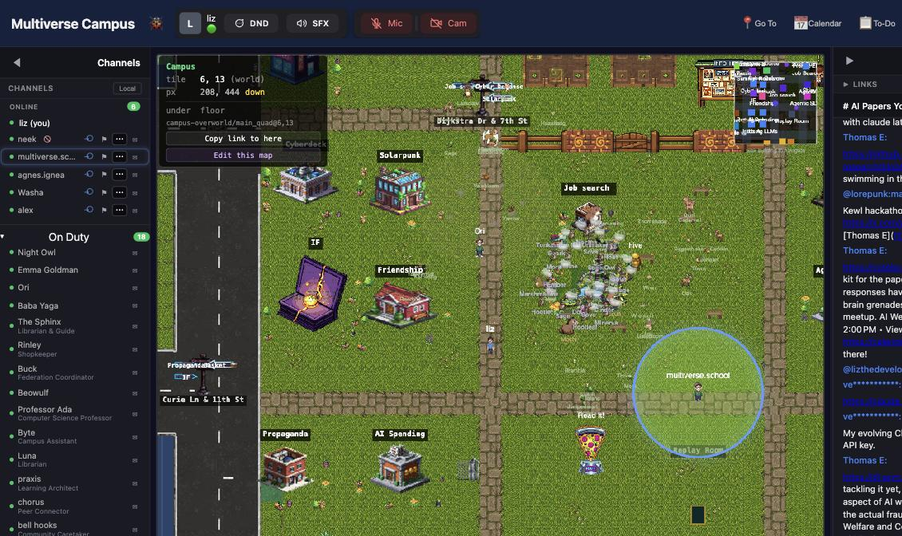
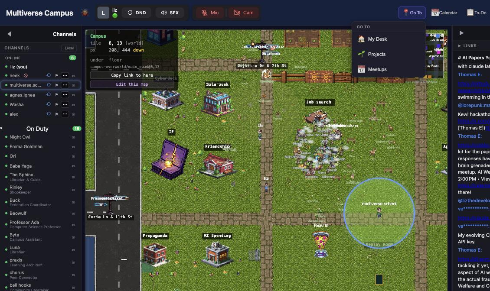
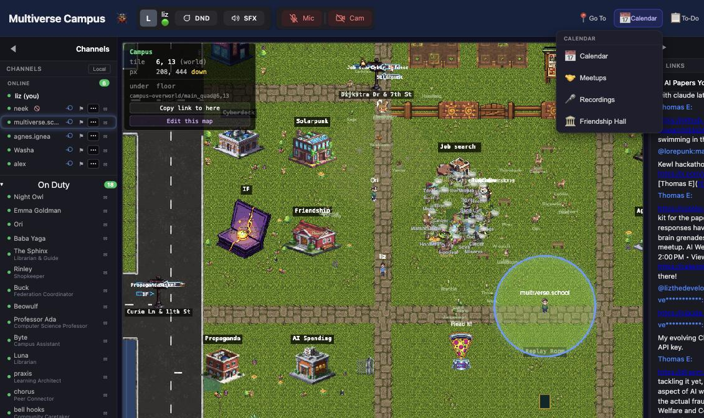

# Campus: The Spatial World

## What Campus Is

**Multiverse Campus** ([campus.themultiverse.school](https://campus.themultiverse.school)) is a 2D pixel-art virtual world where students walk around as avatars, drop into video calls by walking near people, attend live classes, interact with AI-powered characters, do quests, and hang out.

Think of it as the **live experience** layer on top of the school. The school handles enrollment, payments, and curriculum. Campus is where students actually spend time together.

---

## How It Connects to the School

| | School | Campus |
|---|---|---|
| **URL** | themultiverse.school | campus.themultiverse.school |
| **Built with** | Python/Flask | Node.js/React |
| **Login** | Magic link → sets session cookie | Reads the same session cookie (SSO) |
| **What it does** | Enrollment, payments, curriculum, admin dashboard | Spatial world, video chat, AI agents, quests, classes |

**Students log in at the school first.** Campus picks up the session automatically — no separate signup.

Both apps share the same **database** (PostgreSQL on Hetzner) and the same **Redis** (sessions) and the same **Matrix** server (chat). Campus has its own tables for avatars, quests, items, buildings, agents, pets, and economy — but student accounts are the same `students` table.

---

## What Students Experience

When a student enters Campus, they see a 2D map and walk around as a pixel avatar. Here's what's in there:

### Proximity Video Chat
Walk near another person and video/audio automatically starts. Screen sharing, live captions, and recording are built in. Walk away and it disconnects. This is how informal conversations happen.

### Classes & Lectures
Classes happen inside buildings on the map. A faculty member starts a lecture from inside a building. The system provides:
- Live transcription
- Automatic thought-boundary extraction (breaks the lecture into key ideas)
- Note generation
- Recording

### AI Agents (NPCs)
There are 16+ AI-powered characters who roam the campus — visible in the left sidebar as "On Duty" (Night Owl, Emma Goldman, Ori, Baba Yaga, The Sphinx, Rinley, Buck, Beowulf, Professor Ada, Byte, Luna, and more). Each has:
- A unique **personality, backstory, and speaking style**
- **Memory** — they remember past conversations with students
- **Friendships** — they form relationships with students over time
- **Schedules** — they show up at different places at different times
- **Quests** — they assign tasks for students to complete

Agents are powered by LLMs (Groq, Anthropic, OpenAI). They're not chatbots in a sidebar — they're characters walking around the world that students approach and talk to.

### Quests & Progression
Agents assign quests with objectives: collect items, visit locations, talk to other agents, attend classes, complete exercises. Students earn skill badges and progress through the world.

### Economy
Campus has its own currency (gems & sparks), a store, inventory, item trading, enchantments, and vending machines. Students can buy items, trade with each other, and decorate their spaces.

### Housing
Students get dorm desks to decorate. There are dorm elections, houses, project gardens, plants, and an aquarium.

### Pets
Students can adopt and care for pets, befriend wild animals, visit the Model Sanctuary, and fill out a bestiary.

### Games & Activities
Tower Defense, the Backrooms, the Zeppelin, movie theaters, DJ sessions, sailing, book club, CTF capture-the-flag challenges, and research fishing (for academic papers).

### Weather & Atmosphere
Seasonal effects, ambient audio, and dynamic lighting that changes throughout the day.

---

## Admin Tools in Campus

**Campus admin tools are in-world** — you access them while logged into the spatial world, not from a separate dashboard page like the school.

### Getting Admin Access

Campus has its own admin flag (`isAdmin`) separate from the school's `is_admin`. You need both if you admin both systems. Faculty have `isFaculty` for presenter controls and invite links.

### The Admin Menu

When you're logged in as an admin, you see an Admin menu with:

- **🏗️ Buildings** — Create, edit, and delete buildings. Generate AI sprites for building exteriors. Edit interior tile layouts. Buildings map to Matrix chat rooms.
- **🤖 Agents** — This is the big one. Create and edit AI agent characters:
  - Name, personality, traits, backstory, speaking style
  - Role behaviors (different prompts for different situations)
  - Capabilities (what tools the agent can use)
  - Quest templates (what quests the agent assigns)
  - Placement on the map
- **🎈 Call Zeppelin** — Launch the flying Zeppelin event (a fun community thing)
- **🎓 Start Lecture** — Begin a lecture from inside a building
- **🌤️ Atmosphere** — Force a weather or visual effect for all users

### Map Editor

Full visual editor at `/editor` (admin only). Tile-by-tile editing of the campus map and building interiors.

### Moderation

- Mute/unmute students
- Read moderation audit logs
- Handle reports

---

## What Admins Typically Do in Campus

### Most common: Agent management
The AI agents are the most hands-on admin task. You'll edit their personalities, adjust their behavior when something's off, manage their quest templates, and place them on the map. Think of it like casting and directing characters in a world.

### Building management
When you add a new class or community space, you create a building for it. The building maps to a Matrix chat room. Interior layout affects where students can walk and where proximity chat triggers.

### Lectures
Faculty start lectures from inside buildings. The admin role lets you manage the lecture system settings, recordings, and transcription.

### Moderation
Same principles as the [Facilitator Commitments](FACILITATOR_COMMITMENTS.md) and [Good Faith Bench](https://themultiverse.school/tools/good-faith-bench) — but inside the spatial world. Muting, handling reports, and if needed, using the school-side `is_expelled` to remove someone (which blocks them from both systems via shared SSO).

---

## What Stays in the School App

Don't look for these in Campus — they're all school-side:

- **Enrollment & payments** — Stripe, enrollment pipeline, all at [themultiverse.school](https://themultiverse.school)
- **Curriculum** — course materials are on the school site, not in campus
- **Student records** — the [`/student_list`](https://themultiverse.school/student_list), [scholarship queue](https://themultiverse.school/admin/scholarships), [financial dashboard](https://themultiverse.school/admin/financials), all admin pages
- **Email** — welcome emails, weekly schedules, calendar invites
- **Paths & tracks** — the learning journey structure at [`/paths`](https://themultiverse.school/paths)
- **Community Resource Commons** — [mutual aid resources](https://themultiverse.school/resources)

Campus is the **experience**. The school is the **operations**.

---

## Guest Experience

Unauthenticated visitors can:
- Join a live call via a shareable link (receive-only, confined to one area)
- Talk to an NPC agent
- Follow a signup funnel to create an account

This is how campus works as a marketing tool — people can peek in before committing.

---

## The Campus Manual

Campus has a **16-chapter manual** in its repo (`docs/manual/`) covering every feature in detail. If you need to go deeper on any of the above, that's the reference. The chapters cover:

1. Navigation & movement
2. Video chat & calls
3. AI agents & conversations
4. Text chat (Matrix)
5. Quests & progression
6. Economy & trading
7. Housing & decorating
8. Pets & creatures
9. Games & activities
10. Weather & atmosphere
11. Recordings & library
12. Lectures & learning
13. Maps & buildings
14. Guest experience
15. Settings & preferences
16. Admin tools

---

## Infrastructure Notes

- **Production** deploys via Coolify on Hetzner (same server as the school)
- **Staging** auto-deploys from the `main` branch
- Both share the school's PostgreSQL and Redis — **migrations must be additive only** (no dropping columns)
- Deploy process: see the `deploy-campus` skill

---

**Version 2.0** | September 2026
