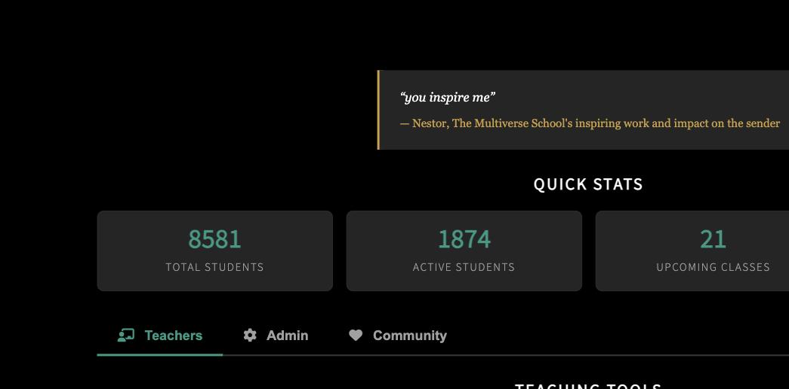
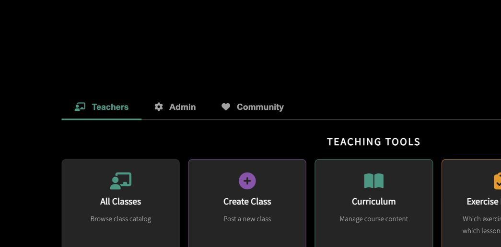
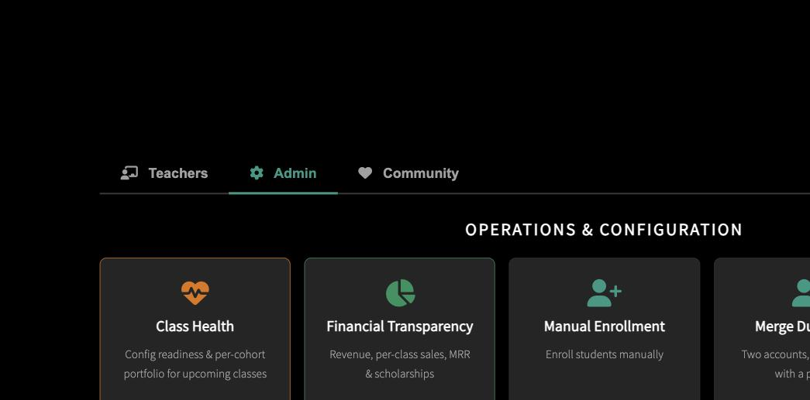
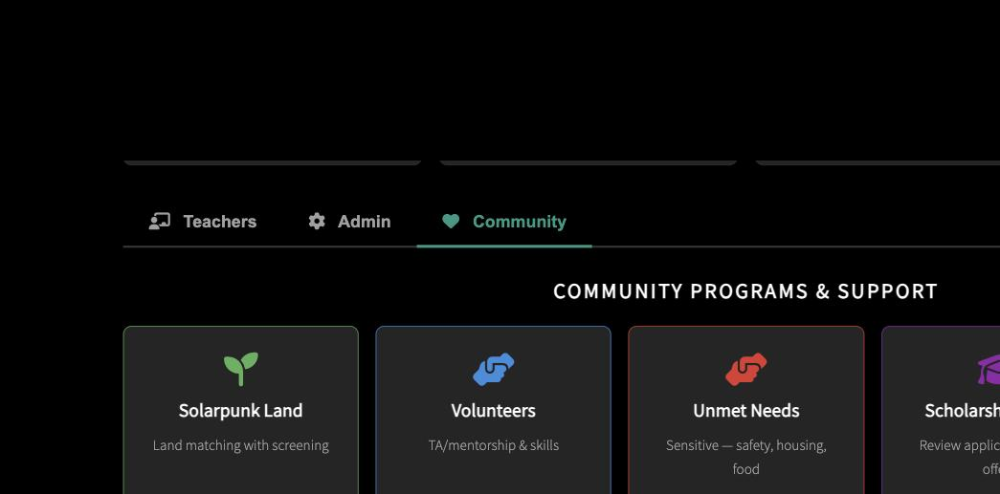

# The Multiverse School: Teacher & Moderator Handbook

**A Guide to Supporting Neurodivergent Adult Learners with Care, Boundaries, and Safety**

---

## Start Here

**👋 Are you a student who found this handbook?** → Read [this note first](README_IF_YOU_ARE_A_STUDENT.md)

**🚨 Dealing with a crisis right now?** → Jump to [Crisis Response](#-crisis-response)

**🆕 New facilitator getting oriented?** → Start with [Essential Reading](#-essential-reading-for-new-facilitators)

**📖 Looking for something specific?** → Browse sections below or see [Full Table of Contents](#full-table-of-contents)

---

## About This Handbook

This handbook helps facilitators navigate the complex, rewarding work of supporting adult learners—many of whom are neurodivergent, healing from trauma, or experiencing mental health challenges.

**Our approach:** We practice liberatory pedagogy, drawing from Paulo Freire, bell hooks, Emma Goldman, and indigenous healing traditions. We build mutual aid, not hierarchy. We dare to love deeply—which includes setting fierce boundaries when needed.

**Our commitments:** See [Facilitator Commitments](FACILITATOR_COMMITMENTS.md) for what we commit to in our practice.

**Our framework:** See [Liberatory Pedagogy Framework](LIBERATORY_FRAMEWORK.md) for the theoretical grounding.

**Who this is for:** New facilitators, moderators, administrators, and the founder—anyone supporting this learning community.

---

## Core Principles

**Love as Political Practice** — We care enough to confront harm. Boundaries protect collective wellbeing.

**Relational Accountability** — We're co-learners, not managers. Power exists; we make it transparent.

**Early Recognition Supports Healing** — We notice patterns and ask "what healing do you need?" not "what's wrong with you?"

**Mutual Aid, Not Saviorism** — We practice voluntary cooperation. We refer, we don't rescue.

---

## 🔧 Operations Quick Reference

The philosophical framework above guides *how* we work. This section covers *where* to do it in the system.

### Admin Dashboard

All admin pages live at `/admin/*` in the main app ([themultiverse.school](https://themultiverse.school)). Log in with your admin account and navigate to any of these:

| Page | What it's for |
|---|---|
| `/admin/dashboard` | Main overview — students, classes, enrollment status |
| `/admin/scholarships` | Review scholarship applications, grant awards, track attendance gates |
| `/admin/community/submissions` | Moderate community resource submissions |
| `/admin/jobs` | Background job monitoring — enrollment pipeline, email sends, calendar syncs |
| `/admin/capstones` | Manage capstone ritual events (comedy nights, showcases) |
| `/admin/skill-map` | Visual map of curriculum skills and dependencies |
| `/admin/db-api-tokens` | Manage developer database access tokens |

The dashboard has three tabs:

**Teachers** — Class catalog, curriculum editor, exercises, skill map, program manager, schedules, and the Bazaar.

**Admin** — Operations & configuration: class health, financials, enrollment, student management, scholarships, experiments, and the admin handbook.

**Community** — Community programs, mutual aid, volunteers, unmet needs, resource moderation.

### Student Records

The `students` table is the users table — everyone who logs in has a row, whether or not they're enrolled in classes. Key fields facilitators should know about:

- **`admin`** — Grants admin dashboard access
- **`researcher`** — Grants research-level curriculum access (all materials)
- **`scholarship`** — Marks scholarship recipients. These students have attendance gates: they must maintain participation in Job Search standup (or Learn to Code drop-in) to keep access. See the scholarship section in GETTING_STARTED.md for details.
- **`is_expelled`** — Removal from the platform. This is the system mechanism for the removal decisions described in [Student Removal & Re-entry](part4/removal-reentry.md) and Commitment #7 in [Facilitator Commitments](FACILITATOR_COMMITMENTS.md).
- **`membership_level`** / **`support_tier`** — Subscription status. Support tiers (supporter/sustainer/patron) grant curriculum access at different levels.

### Good Faith Bench

The [Good Faith Bench](/tools/good-faith-bench) is the operational tool for the triage and escalation work described throughout this handbook's case studies. It helps facilitators distinguish between genuine difficulty and bad-faith behavior using structured assessment rather than vibes.

Full decision framework: `docs/BAD_FAITH_TRIAGE.md` in the school repo.

### Enrollment Architecture

Enrollment has three coexisting paths — a real-time Stripe webhook, a connected account webhook (for teacher marketplace payments), and a batch job that runs every ~10 minutes as a safety net. **This system is fragile.** All three paths must be understood before making changes.

**Do NOT manually edit enrollment tables** (`student_classes`, `purchases`). Stripe is the source of truth — manual changes will be overwritten.

Full documentation: `docs/ENROLLMENT_ARCHITECTURE.md` in the school repo.

### Communication Channels

- **Matrix** ([matrix.themultiverse.school](https://matrix.themultiverse.school)) — Community chat. Class rooms use a two-tier structure: a private cohort room (invite-only, for enrolled students) and a public alias (for discovery).
- **Email** — Sent via SendGrid. Welcome emails, weekly schedules, and calendar invites are automated through the enrollment pipeline.
- **Support inbox** — aethrix@themultiverse.school — for student support, transfers, and account issues.

### Class Setup

Before publishing a new class, use the teacher-facing checklist: `docs/TEACHER_CLASS_SETUP_CHECKLIST.md` in the school repo.

### Paths, Tracks & Programs

The school organizes learning into:
- **Tracks** — Thematic groupings of classes (e.g., Defender, Independence). $250/month per track.
- **Paths** — Student-facing learning journeys with dashboards at `/paths`.
- **Programs** — Data-driven pages at `/programs/<slug>` with curriculum summaries and schedules.
- **Support tiers** — $60 (interest), $250 (learning), $500 (full access) monthly subscriptions.

### Where This Handbook Lives

This handbook is served at [`/admin/handbook`](https://themultiverse.school/admin/handbook) in the school app (admin login required). It's also a standalone git repo at [github.com/lizTheDeveloper/multiverse-admin-handbook](https://github.com/lizTheDeveloper/multiverse-admin-handbook).

---

## 🚨 Crisis Response

**Dealing with an emergency right now?**
- [Responding to Suicidal Students](part3/suicidal-students.md)
- [Crisis Resource Appendix](crisis_resource_appendix.md)
- [Emergency Response Flowchart](quick-reference/emergency-flowchart.md)
- [De-escalation Scripts](part3/de-escalation-scripts.md)

---

## 📚 Essential Reading for New Facilitators

**Start with these to understand the foundation:**
- [**Liberatory Pedagogy Framework**](LIBERATORY_FRAMEWORK.md) ⭐ Read this first
- [**Facilitator Commitments**](FACILITATOR_COMMITMENTS.md) - What we commit to in our practice
- [Who We Serve: Student Profile](part1/student-profile.md)
- [Understanding Neurodivergence](part1/neurodivergence.md)
- [Crisis Response Protocol](teacher_escalation_protocol.md)
- [Relational Accountability & Boundaries](part5/teacher-boundaries.md)

---

## 📋 Policies & Guidelines

- [The Multiverse School Code of Conduct](part4/multiverse-code-of-conduct.md)
- [Mentoring Guidelines](part4/mentoring-guidelines.md)
- [Mutual Aid Guidelines](part4/mutual-aid-guidelines.md)
- [Cohabitation Policy](part4/cohabitation-policy.md)
- [Student Removal & Re-entry](part4/removal-reentry.md)

---

## 🧠 Mental Health Resources

**Pattern recognition guides for facilitators:**
- [Borderline Personality Disorder (BPD)](part7/borderline-personality-disorder.md)
- [Schizophrenia & Psychosis](part7/schizophrenia-psychosis.md)
- [Dependent Personality Disorder](part7/dependent-personality-disorder.md)
- [When Students Trauma-Bond](part5/trauma-bonding.md)

---

## 📖 Learn from Examples

**Case studies and scenarios for practice:**
- [Case Study: The Crisis-Dependent Student](part6/case-crisis-dependent.md)
- [Case Study: The Aspiring Guru](part6/case-aspiring-guru.md)
- [Case Study: The Rapid Community Builder](part6/case-community-builder.md)
- [Scenario Library: Practice Responses](part6/scenario-library.md)
- [Decolonizing Entitled Learners: A Scenario-Based Guide](part6/decolonizing-entitled-learners.md)

---

## 🔬 Evidence Base

- [Research Sources & Citations](part7/research-sources.md)
- [Citation Verification Report](CITATION_VERIFICATION.md)

---

## Full Table of Contents

See [SUMMARY.md](SUMMARY.md) for complete handbook structure with all sections.

---

## About The Multiverse School

Founded by Liz Howard, The Multiverse School is an experimental adult education community dedicated to supporting unconventional learners. We believe in radical accessibility, peer learning, and the transformative power of education—held within strong ethical containers.

This handbook represents years of lived experience, mistakes, course-corrections, and hard-won wisdom. Use it well.

---

**Version 2.0** | Last Updated: September 2026 | Maintained by Liz Howard
