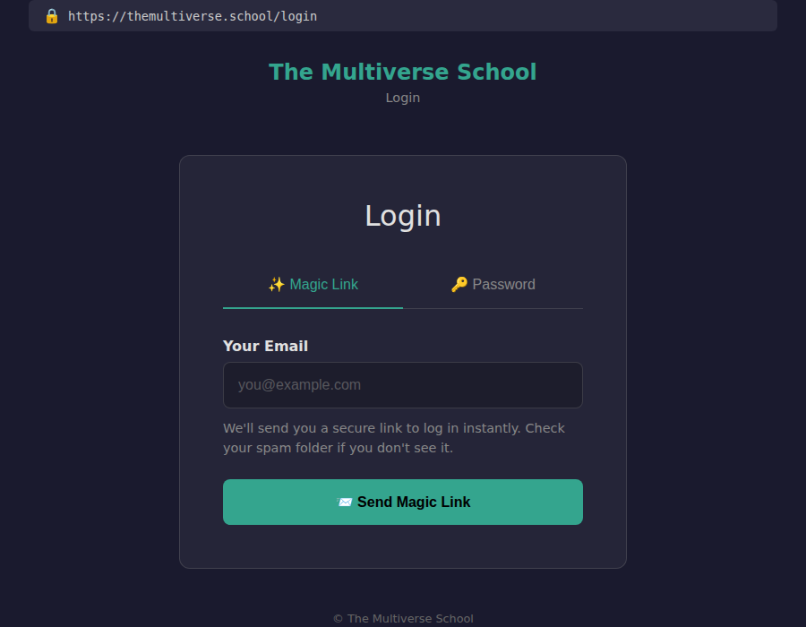
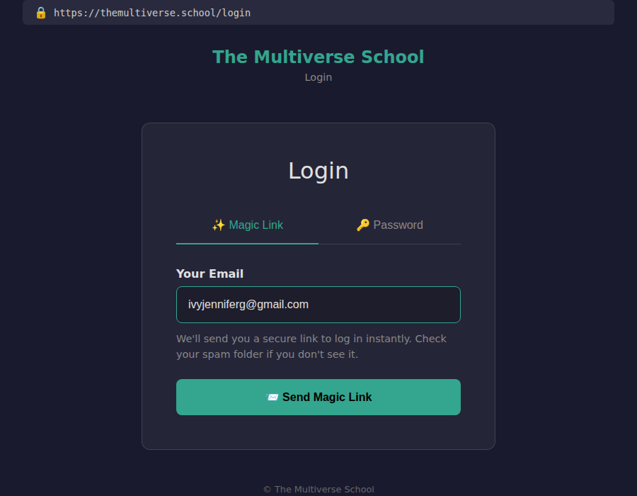
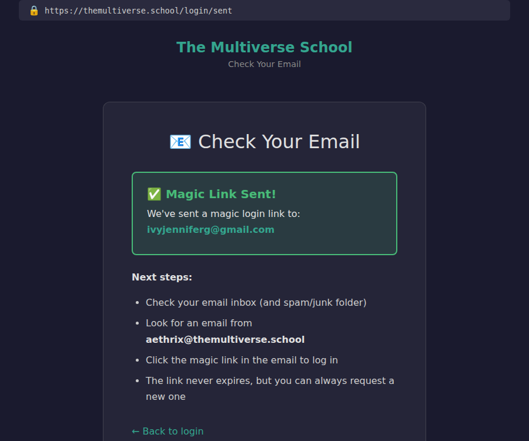

# Staff Account Setup Checklist

**For:** Whoever is setting up system access for a new staff member.
**When:** Before their first day, or on day one at the latest.

Walk this list top to bottom. Each step is tagged with the roles it applies
to. Skip anything that doesn't match the person's role. Tick as you go.

**Roles:**
- **All** — every staff member, regardless of role
- **Inbox** — student-facing support / inbox duty
- **Teacher** — teaching a class
- **Engineer** — writing code, deploying, investigating

A person can hold more than one role. If someone is doing inbox duty *and*
teaching, tick both columns.

---

## The Checklist

| # | Step | All | Inbox | Teacher | Engineer |
|---|---|:---:|:---:|:---:|:---:|
| 1 | [Create Google Workspace account](#1-create-google-workspace-account) | x | | | |
| 2 | [Share the school Google Calendar](#2-share-the-school-google-calendar) | x | | | |
| 3 | [Share Google Drive folders](#3-share-google-drive-folders) | x | | | |
| 4 | [Create their site account](#4-create-their-site-account) | x | | | |
| 5 | [Create their Matrix account and join staff rooms](#5-create-their-matrix-account-and-join-staff-rooms) | x | | | |
| 6 | [Add to GitHub org](#6-add-to-github-org) | | x | | x |
| 7 | [Set `faculty` flag](#7-set-faculty-flag) | | | x | |
| 8 | [Set `admin` flag](#8-set-admin-flag) | | x | | x |
| 9 | [Delegate `aethrix@` mailbox access](#9-delegate-aethrix-mailbox-access) | | x | | |
| 10 | [Invite to Stripe dashboard](#10-invite-to-stripe-dashboard) | | x | | |
| 11 | [Invite to SendGrid](#11-invite-to-sendgrid) | | x | | |
| 12 | [Create Vaultwarden account](#12-create-vaultwarden-account) | | x | | x |
| 13 | [Grant GitHub repo write access](#13-grant-github-repo-write-access) | | | | x |
| 14 | [Grant Claims Kanban board access](#14-grant-claims-kanban-board-access) | | x | | |
| 15 | [Verify campus SSO login works](#15-verify-campus-sso-login-works) | x | | | |
| 16 | [Register address in the guard test](#16-register-address-in-the-guard-test) | | x | | x |
| 17 | [Mint a production DB token](#17-mint-a-production-db-token) | | x | | x |

---

## Step Details

### 1. Create Google Workspace account

**Roles:** All

1. Sign in to [Google Admin Console](https://admin.google.com) as a Workspace
   admin.
2. Go to **Directory > Users > Add new user**.
3. Use the naming convention: `firstname@themultiverse.school` (lowercase,
   first name only). If there's a collision, use `firstnamelastinitial@`.
4. Set a temporary password and check **Ask for a password change at next
   sign-in**.
5. Send the new staff member their address and temporary password over a
   secure channel (not plain email — use Signal, a phone call, or in person).

**Verify:** They can sign in to Gmail at their new address and send/receive
a test message.

---

### 2. Share the school Google Calendar

**Roles:** All

1. Open [Google Calendar](https://calendar.google.com) while signed in as an
   existing admin.
2. Find the school calendar in the left sidebar (named "The Multiverse
   School" or similar — calendar ID:
   `c_e9fbd687c00a0947f9bb561a447d8b98164989ac6d7e58b527ba43097e9d1abe@group.calendar.google.com`).
3. Click the three-dot menu > **Settings and sharing**.
4. Under **Share with specific people or groups**, click **Add people and groups**.
5. Enter their new `@themultiverse.school` address.
6. Set permission to **See all event details** for most staff, or **Make
   changes to events** for anyone who will create or edit class calendar
   entries.

**Verify:** They can see this week's classes on their calendar.

---

### 3. Share Google Drive folders

**Roles:** All

Share the class recordings folder with their new address. For inbox staff and
teachers, also share any folders relevant to their classes or duties.

1. Open [Google Drive](https://drive.google.com).
2. Right-click the folder > **Share**.
3. Enter their `@themultiverse.school` address with **Viewer** access (or
   **Editor** if they'll be uploading recordings).

**Verify:** They can open a class recording folder and play a video.

---

### 4. Create their site account

**Roles:** All

The `students` table is the users table for everyone who logs in, not just
enrolled students. The new staff member needs a row here.

The easiest way is to have them log in for the first time — that creates
their account automatically. Walk them through this:

#### Magic link login walkthrough

**Step 1.** Open a browser and go to
**[https://themultiverse.school/login](https://themultiverse.school/login)**.

You will see the login page with two tabs: **Magic Link** (selected by
default) and **Password**. Leave it on Magic Link.



**Step 2.** In the **Your Email** field, type the email address they will
use for their account (e.g. `ivyjenniferg@gmail.com` — whatever personal
email they use, or their `@themultiverse.school` address if they have one).

Then click **Send Magic Link**.



**Step 3.** The page will show a **"Magic Link Sent!"** confirmation with
the email address it was sent to.



**Step 4.** Check the inbox for that email address (and the spam/junk
folder). Look for an email from **aethrix@themultiverse.school**. Click
the link in the email — it logs you in and creates the account if it does
not already exist.

If the email does not arrive within a few minutes, check that the address
was typed correctly (no typos, all lowercase) and try again.

#### Alternative: create the account directly in the database

If you have database access, you can create the row without the magic link
flow:

```sql
INSERT INTO students (email, name, created_at)
VALUES ('their_email@example.com', 'First Last', NOW())
ON CONFLICT (email) DO NOTHING;
```

They will still need to use the magic link login to sign in — this just
pre-creates their row so you can set flags on it.

**Verify:** They can log in to the site and see their dashboard.

**Note:** This step must happen before setting the `admin` or `faculty`
flags (steps 7-8), since those flags are columns on this row.

---

### 5. Create their Matrix account and join staff rooms

**Roles:** All

Staff Matrix accounts are created manually (students are auto-provisioned,
staff are not).

1. Use the Synapse Admin API to create the account. From the server or via
   the bot's admin token:

```bash
curl -X PUT \
  "https://matrix.themultiverse.school/_synapse/admin/v2/users/@firstname:themultiverse.school" \
  -H "Authorization: Bearer <ADMIN_TOKEN>" \
  -H "Content-Type: application/json" \
  -d '{
    "password": "<temporary-password>",
    "displayname": "First Last",
    "admin": false
  }'
```

2. Send them the username (`@firstname:themultiverse.school`) and temporary
   password over a secure channel.
3. Have them sign in via [Element](https://element.io) or another Matrix
   client, using the homeserver `matrix.themultiverse.school`.
4. Invite them to the staff room(s) and at least one class room.

**Verify:** They are in the staff room and can send a message.

---

### 6. Add to GitHub org

**Roles:** Inbox, Engineer

1. Go to the [lizthedeveloper GitHub org](https://github.com/lizthedeveloper)
   settings > **People** > **Invite member**.
2. Enter their GitHub username.
3. Grant at minimum **issues read/write** on
   `lizthedeveloper/themultiverse.school`.

For engineers, see also [step 13](#13-grant-github-repo-write-access) for
write access to repos.

**Verify:** They can open an issue on the school repo.

---

### 7. Set `faculty` flag

**Roles:** Teacher

This grants teacher-level access: view unpublished curriculum, class-level
admin pages, HedgeDoc access.

```sql
UPDATE students
SET faculty = true
WHERE email = 'firstname@themultiverse.school';
```

**Verify:** They can see unpublished curriculum pages when logged in.

**Note:** This is narrower than `admin`. Only set `admin` (step 8) if the
teacher needs full admin access — currently 4 of 7 teachers have it, but it's
not automatic.

---

### 8. Set `admin` flag

**Roles:** Inbox, Engineer (optional for Teacher)

This grants full access to all `/admin/*` pages, all curriculum, engineering
decks, and the ability to mint DB API tokens.

```sql
UPDATE students
SET admin = true
WHERE email = 'firstname@themultiverse.school';
```

**Verify:** They can load `/admin/dashboard`.

---

### 9. Delegate `aethrix@` mailbox access

**Roles:** Inbox

`aethrix@themultiverse.school` is the primary school inbox. Nearly all
student email sends from and arrives at this address.

1. Sign in to [Google Admin Console](https://admin.google.com).
2. Go to **Directory > Users** and select the `aethrix` account.
3. Open **Mail settings** (or go to Gmail settings for the account).
4. Under **Mail delegation**, add the new staff member's
   `@themultiverse.school` address as a delegate.

Alternatively, from the `aethrix@` Gmail directly:
1. Go to **Settings > Accounts > Grant access to your account**.
2. Add their address.

**Verify:** They can open Gmail, switch to the `aethrix@` inbox, and read
messages. They can compose a message *as* `aethrix@themultiverse.school`.

---

### 10. Invite to Stripe dashboard

**Roles:** Inbox

1. Sign in to [Stripe Dashboard](https://dashboard.stripe.com).
2. Go to **Settings > Team** > **Invite a team member**.
3. Enter their email and set role to **Analyst** (read-only) or **Developer**
   depending on need. Inbox staff should be read-only.

**Verify:** They can find a charge from a student's email address.

---

### 11. Invite to SendGrid

**Roles:** Inbox

Needed for diagnosing "the email never arrived" support requests.

1. Sign in to [SendGrid](https://app.sendgrid.com).
2. Go to **Settings > Teammates** > **Add Teammate**.
3. Enter their email. Grant read-only access to **Activity** (email
   delivery logs).

**Verify:** They can search email delivery status by recipient address.

---

### 12. Create Vaultwarden account

**Roles:** Inbox, Engineer

All production secrets are stored in the self-hosted Vaultwarden (Bitwarden-
compatible) instance. Never distribute credentials outside the vault.

1. Go to the Vaultwarden admin panel at `https://37.27.36.108:8443/admin`.
2. Invite the new staff member by their `@themultiverse.school` email.
3. They accept the invite, create their vault account, and install the
   Bitwarden CLI (`bw`).

**Verify:** They can run `bw login` and `bw unlock`, then retrieve a test
item.

**Important:** New staff should read the rules in `CLAUDE.md` under "Secrets
Management" — never commit secrets, never print them in full, never modify
vault items unless you are certain about what you are doing.

---

### 13. Grant GitHub repo write access

**Roles:** Engineer

Beyond the issues-level access in step 6, engineers need write access to push
code.

1. In the GitHub org, grant write access to:
   - `lizthedeveloper/themultiverse.school`
   - `lizthedeveloper/multiversecampus`
   - Other repos as needed (e.g., `multiverse-admin-handbook`)

**Verify:** They can push a branch to the school repo.

---

### 14. Grant Claims Kanban board access

**Roles:** Inbox

The claims Kanban board tracks in-progress engineering work. Inbox staff check
it before assuming something is broken and unknown.

Share the board with their account (location depends on where the board
lives — ask the current team).

**Verify:** They can see the board and find an open card.

---

### 15. Verify campus SSO login works

**Roles:** All

Campus uses shared Redis sessions with the school site for cross-domain SSO.
If they can log in to the school site (step 4), campus should work
automatically.

1. Have them visit [campus.themultiverse.school](https://campus.themultiverse.school).
2. They should be logged in already, or be able to log in via the school
   site's magic link.

**Verify:** They can see the campus interface while logged in.

---

### 16. Register address in the guard test

**Roles:** Inbox, Engineer

If their `@themultiverse.school` address will appear anywhere in shipping
code (templates, email senders, seed data, tests), it must be registered in
the address guard test. This prevents stale addresses from accumulating.

Edit `tests/test_advertised_addresses.py` in the school repo:

1. Add their address to the `KNOWN_ADDRESSES` dictionary with a reason
   string.
2. Commit and push with the PR that first uses their address.

**When to skip:** If they will only use their address for Google Workspace
login and never appear in code, this step is not needed yet. Add it when the
address first shows up in a PR.

---

### 17. Mint a production DB token

**Roles:** Inbox, Engineer

Production database access is available via a personal API token. The `admin`
flag (step 8) must be set first.

1. Have them visit `/admin/db-api-tokens` on the school site while logged in.
2. They click to mint a new token (90-day expiry, revocable).
3. They configure the token in their local MCP setup per
   `docs/MCP_PROD_DB_QUERY.md`.

**Verify:** A `SELECT 1` query returns through the MCP.

---

## After Setup

Once all the checkboxes are ticked, point the new staff member to the deeper
onboarding material for their role:

- **Inbox:** Follow Parts 2 and 3 of
  [`docs/INBOX_ONBOARDING_CHECKLIST.md`](https://github.com/lizthedeveloper/themultiverse.school/blob/production/docs/INBOX_ONBOARDING_CHECKLIST.md)
  in the school repo — the reading list and the hands-on proofs.
- **Teacher:** Follow
  [`docs/TEACHER_CLASS_SETUP_CHECKLIST.md`](https://github.com/lizthedeveloper/themultiverse.school/blob/production/docs/TEACHER_CLASS_SETUP_CHECKLIST.md)
  and read this handbook's [Getting Started](GETTING_STARTED.md) guide.
- **Engineer:** Read
  [`docs/DEVELOPMENT_SETUP.md`](https://github.com/lizthedeveloper/themultiverse.school/blob/production/docs/DEVELOPMENT_SETUP.md)
  and the `CLAUDE.md` in whichever repo you'll be working in.

---

## Teardown: When Someone Leaves

Walk this list when revoking access. Order matters — revoke the most sensitive
access first.

| # | Step | Notes |
|---|---|---|
| 1 | Suspend Google Workspace account | Admin Console > Users > Suspend. Do not delete immediately — mail may need to be preserved or forwarded. |
| 2 | Revoke `aethrix@` delegation | Remove them from the delegate list. |
| 3 | Revoke Vaultwarden access | Delete or disable their vault account. |
| 4 | Rotate shared credentials | If they had access to secrets in Vaultwarden that are shared (API keys, webhook secrets), rotate those credentials. |
| 5 | Revoke production DB tokens | Go to `/admin/db-api-tokens` and revoke any tokens they minted. |
| 6 | Remove from GitHub org | Remove from the org or downgrade to no access. |
| 7 | Remove from Stripe dashboard | Settings > Team > remove. |
| 8 | Remove from SendGrid | Settings > Teammates > remove. |
| 9 | Set `admin = false`, `faculty = false` | `UPDATE students SET admin = false, faculty = false WHERE email = '...';` |
| 10 | Remove from Matrix staff rooms | Kick from staff rooms. Optionally deactivate the Matrix account. |
| 11 | Unshare Google Calendar and Drive | Remove their address from sharing settings. |
| 12 | Remove from guard test | If their address is in `tests/test_advertised_addresses.py`, move it to the retired list. |

---

## Open Questions

These are things to decide and fill in as the team grows:

- **Google Workspace org units:** Is there a standard org unit for staff vs.
  students (if student Workspace accounts are ever created), or is everyone at
  the top level?
- **2FA policy:** Should all staff Workspace accounts require 2FA? (Recommended
  yes.)
- **Admin UI for permission flags:** Setting `admin` and `faculty` currently
  requires a raw database update. If the team grows past a handful, an admin
  page for managing staff permissions would reduce the bus factor.
- **SendGrid sender verification:** If a new staff address will appear on
  outbound email From lines (not just the shared `aethrix@`), it must be
  verified as a sender in SendGrid. Currently only `aethrix@`, `liz@`,
  `care@`, and `matching@` are verified senders.
- **`care@` and `matching@` forwards:** The inbox handbook design spec notes
  that the Workspace forwards for these send-only addresses are still an open
  item. Confirm they are configured before relying on them.
